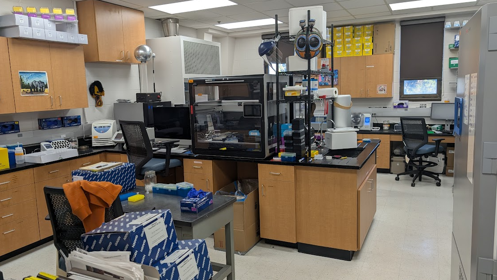
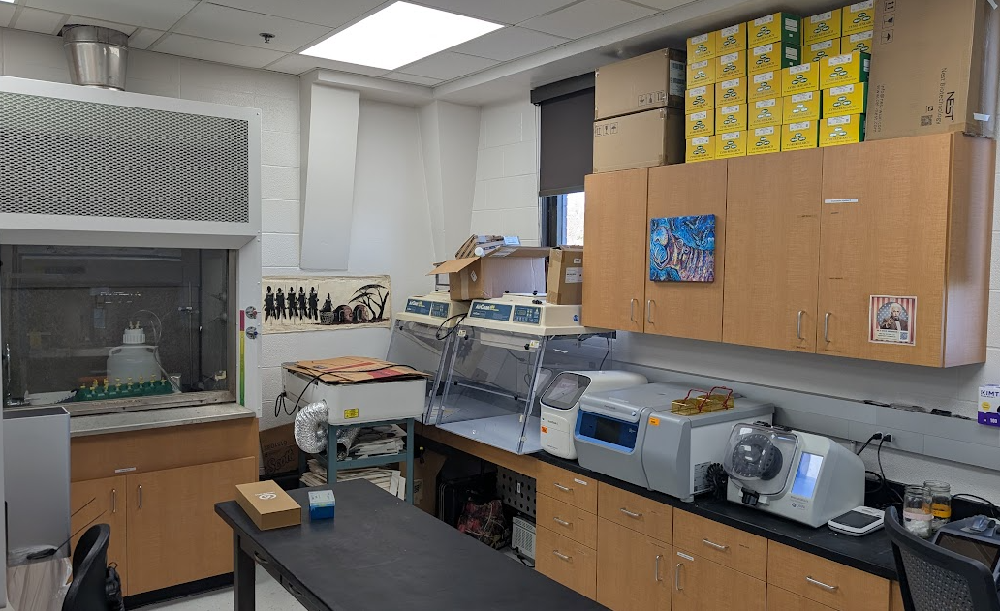
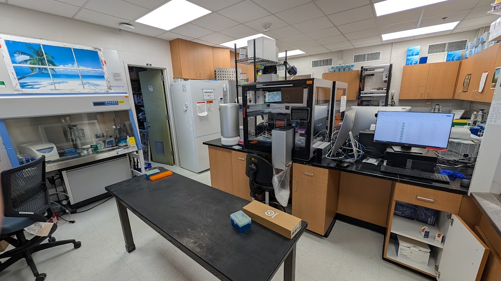
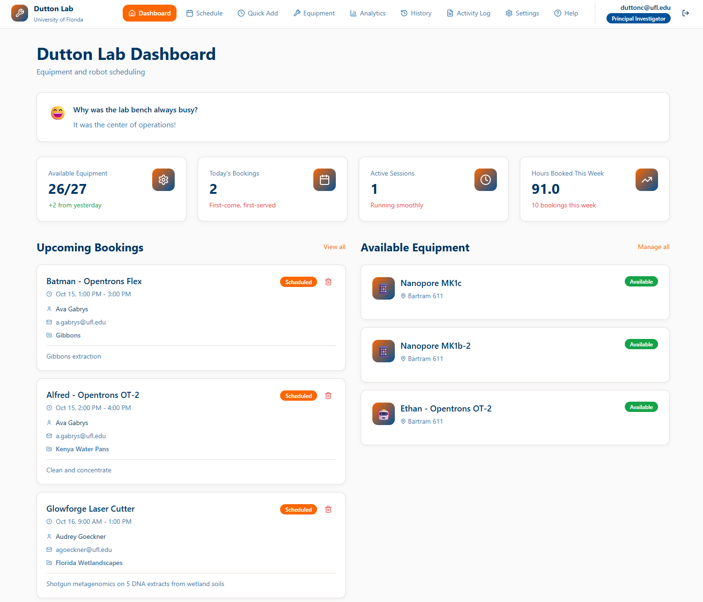
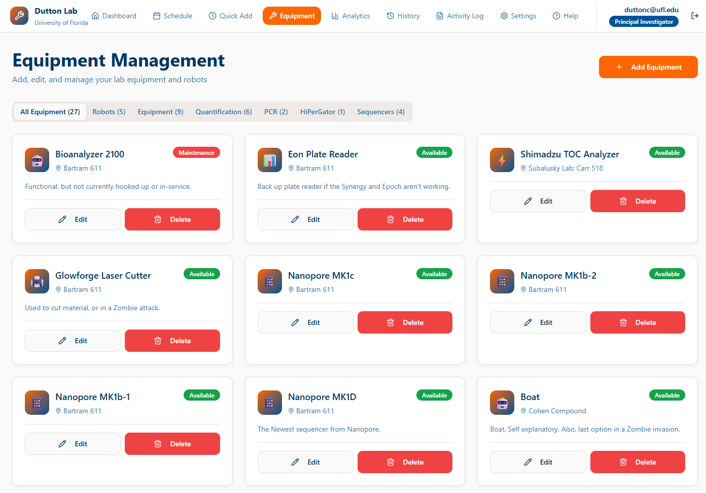
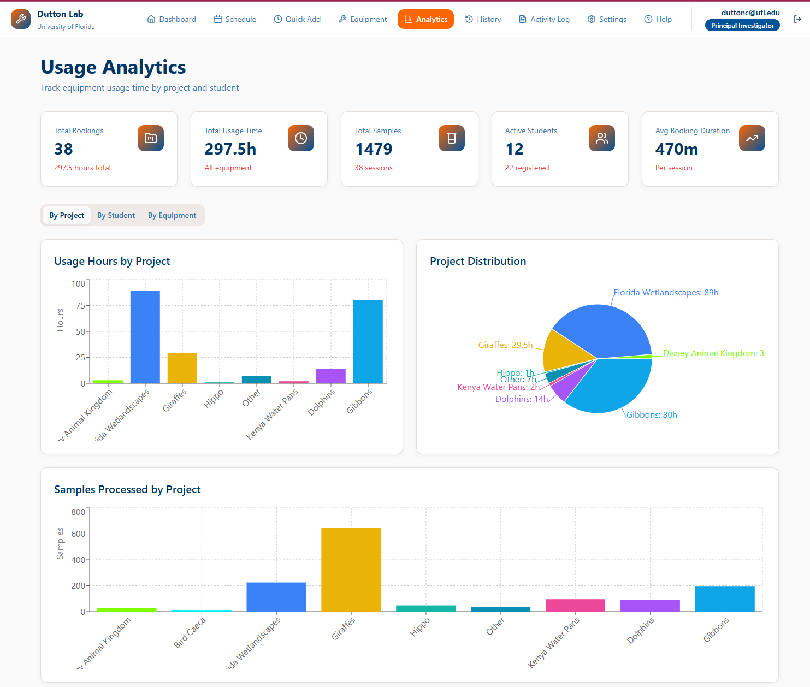

Our lab consists of everything we need to extract, sequence, and analyze DNA or RNA from environmental samples or animals. 

[Lab Equipment Scheduling App](https://ufduttonlab.github.io/lab-scheduler/)

A short list of available equipment:
- Absolutely Q dPCR
- 3 Opentrons OT-2 robots
- 2 Opentrons Flex robots (one with a 96 head pipette)
- 4 Nanopore Minion (different variants)
- Tapestation
- Bioanalyzer
- Centrifuges
- Quantstudio 3 qPCR
- Absolute Q dPCR
- Chai qPCR
- Thermocyclers
- Vortexers
- Computers
- Access to the UF Supercomputer

We use a custom in-house developed scheduling app to track equipment usage on different projects. This allows students to "book" equipment so that we have coordination between all our different projects and people. This also allows us to track effort by students on different projects, so that we can give them proper credit and recognition. [Lab Equipment Scheduling App](https://ufduttonlab.github.io/lab-scheduler/)

{:style="float: left;margin-right: 7px;:class="img-responsive"}

...
