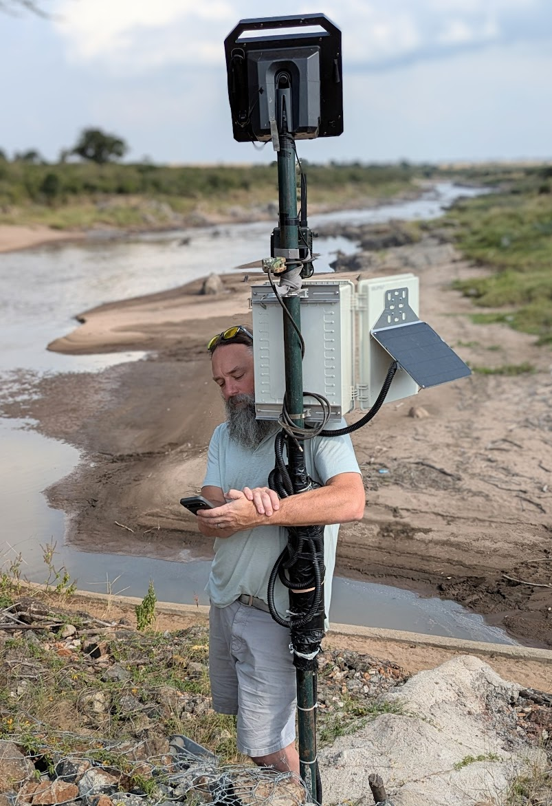
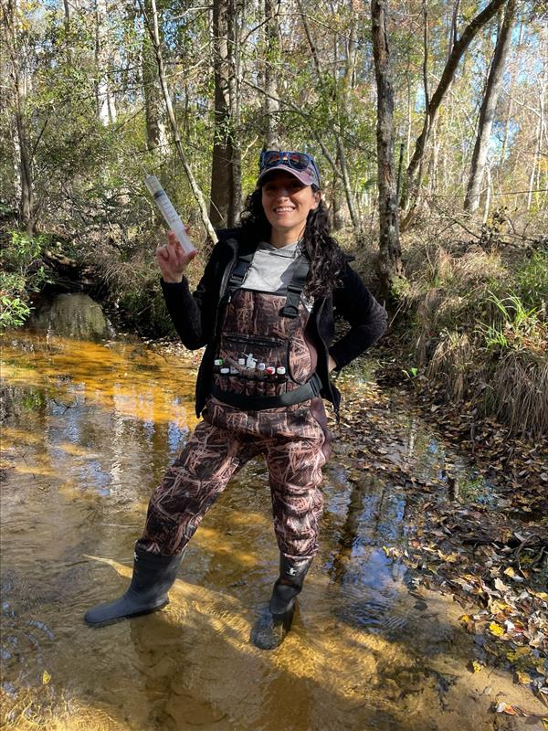
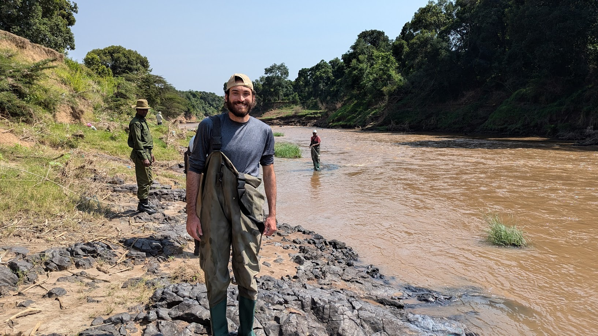
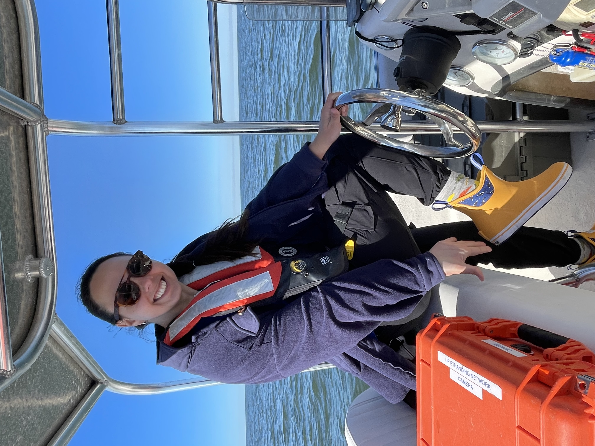
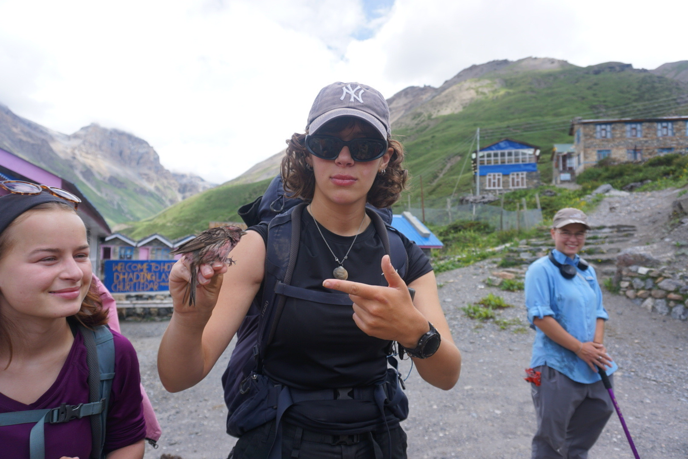
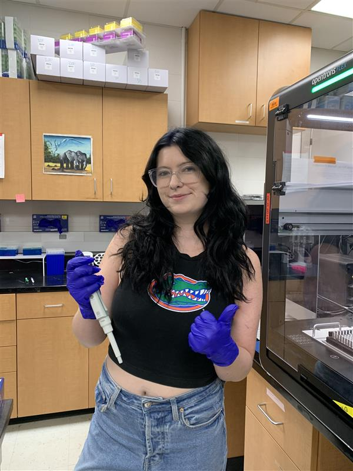

## Christopher Dutton

Chris is an Assistant Professor at the University of Florida who leads the lab, specializing in environmental microbiology, ecology, and open source low-cost technologies. He earned his PhD in 2019 from the Department of Ecology and Evolutionary Biology at Yale University, a Master’s of Environmental Studies from Yale’s School of Forestry and Environmental Studies (2012), and a Bachelor’s degree in saxophone performance, music, and criminal justice from the prestigious School of Music at Indiana University Bloomington (1999). The Dutton Lab at the University of Florida explores how environmental and animal microbiomes shape ecosystems and alter health. Every initiative from the lab aims to make research and education more effective and inclusive, empowering students, scientists, and the broader public to engage with ecology and protect natural resources.

## Postdoctoral Associates
Dr. Audrey Goeckner  

Audrey joined the Dutton lab as a postdoctoral research associate in August 2024. She received her B.S. in environmental science from the University of South Florida in 2017 and her M.S in soil and water sciences from the University of Florida in 2020 working on carbon burial and greenhouse gas fluxes in stormwater ponds. Audrey received her PhD in soil, water, and ecosystem sciences in 2024 from the University of Florida working on the biogeochemistry and microbial ecology of stormwater ponds and their effects on streams that receive pond discharge. In the Dutton lab, Audrey focuses on environmental genomics, contributing to a variety of projects that explore the structure and function of microbial communities at terrestrial-aquatic interfaces, along river continua, and within lake ecosystems. As a freshwater ecosystem and microbial ecologist, Audrey wants to explore what microbial metabolic functions are associated to ecosystem scale fluxes and pools of carbon and nitrogen.

Dr. Emily (Lee) Nonnamaker

## PhD Students

Dawson Houghtaling 

Ava Gabrys

Ava joined the lab as a PhD student in the fall of 2025 on a prestigious US National Science Foundation Graduate Research Fellowship. She received her B.S. in Biology with a concentration in genetics at Penn State, where she explored the evolution of the human oral microbiome and its role in tooth decay. Ava is interested in the intersections between microbial dispersal through environments and hosts, microbial competition, and ecosystem functioning and health.

## Master's Students

Tavis Goldwire

After joining the Dutton lab in 2022 as an undergraduate, Tavis graduated from the University of Florida with a B.S. in Biology in 2025. His undergraduate research included work on Disney's Animal Kingdom microbiomes and an Honors Thesis on microbial transference from hippos to fish. Continuing as a Master's student, Tavis now investigates the links between microbial ecology, zoo practices, and the health of captive giraffe populations. He also loves his cat, Kitty.

Suzanna Mickey

Suzanna joined the Dutton Lab as a part time MS student in Fall 2025. She works full time as a marine mammal stranding biologist for the [UF Marine Animal Rescue program](https://cdpm.vetmed.ufl.edu/services/marine-animal-rescue-program/). Her research focuses on bottlenose dolphins, collaborating with the [Cedar Key Dolphin Project](https://www.cedarkeydolphinproject.org/#/), to explore non-invasive methods for assessing dolphin health. She is studying the respiratory microbiomes of dolphins to investigate the presence of infectious diseases. Her long-term goal is to strengthen the link between health and ecology to better understand and protect dolphin populations. Squint closely to see her amazing xtra tufs with orcas on them. 

## Undergrads

Charlotte Levet Bourtayre

Audrey-Anne Haynes

Cecilia Aragon

Maggie Johnson

Ryleigh Sperry

Ryleigh joined the Dutton lab as an undergrad student in the summer of 2025. She is currently pursuing a degree in Wildlife, Ecology, and Conservation with a pre-professional focus with the goal of attending graduate school to obtain a doctorate in veterinary medicine. Ryleigh is interested in DNA extraction and sequencing in order to answer questions about animal behavior and health.

Will Sophocles

Sierra Mulholland

## Past Members

Alesha Wallen 

Faith Dunlap

Meg Morrow

Serena Huberty

Katelyn Lancaster

Cameron Teal

{:style="float: left;margin-right: 7px;:class="img-responsive"}

...
