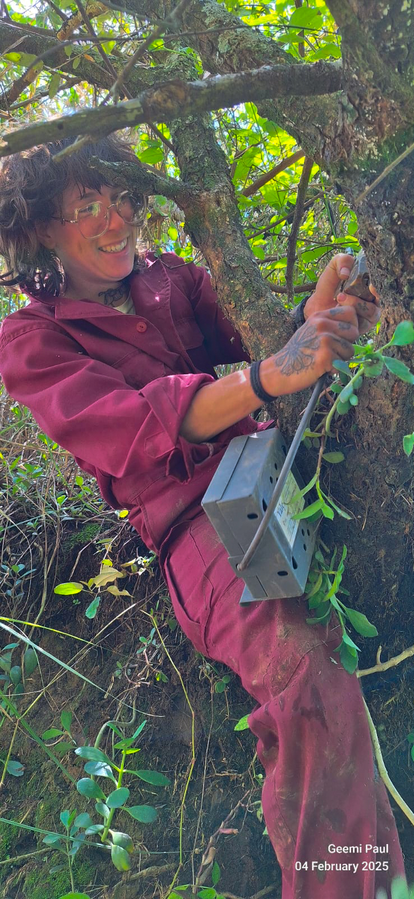
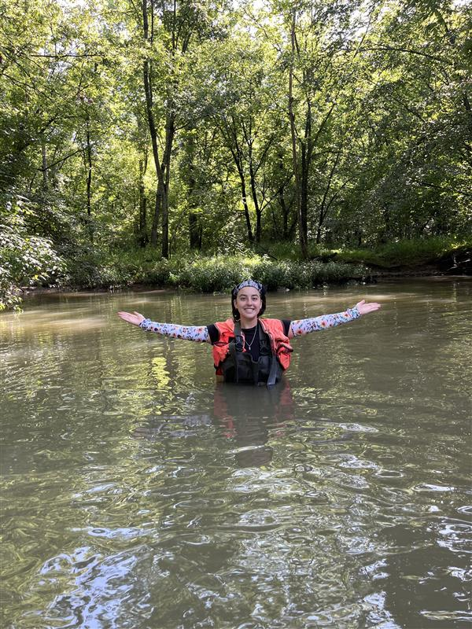
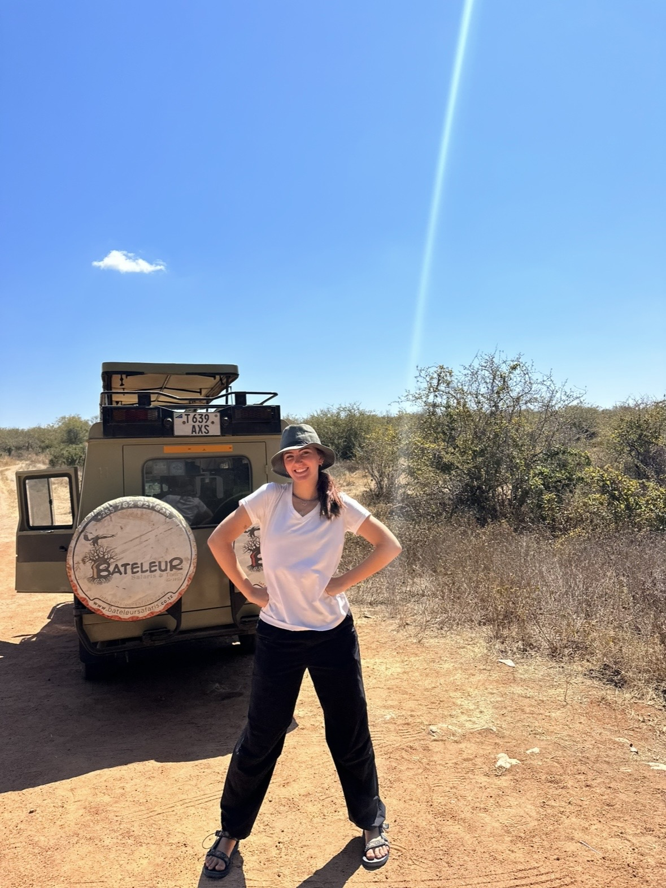
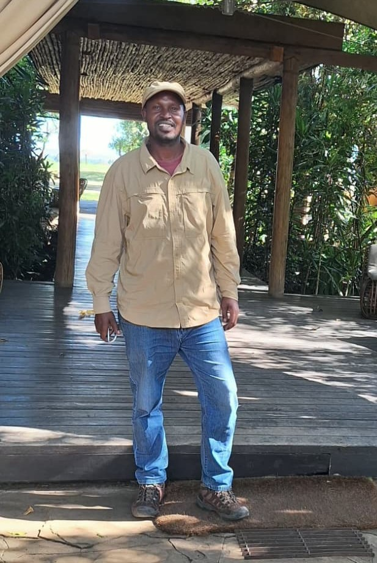

Interested in joining the lab as an [Undergraduate](https://ufduttonlab.github.io/paid-undergrad-research), [Graduate](https://ufduttonlab.github.io/grad-opportunities/), or [Post-doc](https://ufduttonlab.github.io/postdoc-opportunities/)?

## Christopher Dutton

Chris is an Assistant Professor at the University of Florida who leads the lab, specializing in environmental microbiology, ecology, and open source low-cost technologies. He earned his PhD in 2019 from the Department of Ecology and Evolutionary Biology at Yale University, a Master’s of Environmental Studies from Yale’s School of Forestry and Environmental Studies (2012), and a Bachelor’s degree in saxophone performance, music, and criminal justice from the prestigious School of Music at Indiana University Bloomington (1999). The Dutton Lab at the University of Florida explores how environmental and animal microbiomes shape ecosystems and alter health. Every initiative from the lab aims to make research and education more effective and inclusive, empowering students, scientists, and the broader public to engage with ecology and protect natural resources.

# Postdoctoral Associates
## Dr. Audrey Goeckner  

Audrey joined the Dutton lab as a postdoctoral research associate in August 2024. She received her B.S. in environmental science from the University of South Florida in 2017 and her M.S in soil and water sciences from the University of Florida in 2020 working on carbon burial and greenhouse gas fluxes in stormwater ponds. Audrey received her PhD in soil, water, and ecosystem sciences in 2024 from the University of Florida working on the biogeochemistry and microbial ecology of stormwater ponds and their effects on streams that receive pond discharge. In the Dutton lab, Audrey focuses on environmental genomics, contributing to a variety of projects that explore the structure and function of microbial communities at terrestrial-aquatic interfaces, along river continua, and within lake ecosystems. As a freshwater ecosystem and microbial ecologist, Audrey wants to explore what microbial metabolic functions are associated to ecosystem scale fluxes and pools of carbon and nitrogen.

## Dr. Emily (Lee) Nonnamaker

Lee (Emily) Nonnamaker joined the lab in 2024 as a NSF funded postdoctoral researcher. They specialize in the connections between microbiomes and animal behavior. They began their career as an ecologist and animal behaviorist at Tulane University, where they earned their undergraduate and 4+1 masters degrees in 2016 and 2017, respectively. After graduation, they spent a year in the Mara, Kenya working as a research assistant with the Hyena Project, ran by Dr. Kay Holekamp at Michigan State University. Hyena camp and “Maji” camp, run by Drs. Subalusky and Dutton, are neighbors in the Mara, and Lee first met Chris and Amanda during this time. Amanda and Chris helped Lee apply for PhD programs, and in 2024 Lee earned their PhD from The Department of Biology at The University of Notre Dame. Their thesis work focused on the role of the vaginal microbiome in producing odors that may be used to communicate reproductive state in Yellow and Olive Baboons. They collected data for this project from wild animals in Amboseli, Kenya with the Amboseli Baboon Research Project, as well as captive females in Rousset, France at the CNRS SdP. In France, Lee learned how to train animals using positive reinforcement techniques. While finishing their PhD, they chose to apply for an NSF grant in order to work with Amanda and Chris. Now, Lee is bringing an animal behavior perspective to the Dutton lab, studying hippo social behavior and gut microbiomes, back in the Mara, Kenya. They are keen to collaborate with other hippo people.

# PhD Students

## Ava Gabrys

Ava joined the lab as a PhD student in the fall of 2025 on a prestigious US National Science Foundation Graduate Research Fellowship. She received her B.S. in Biology with a concentration in genetics at Penn State, where she explored the evolution of the human oral microbiome and its role in tooth decay. Ava is interested in the intersections between microbial dispersal through environments and hosts, microbial competition, and ecosystem functioning and health.

# Master's Students

## Tavis Goldwire

After joining the Dutton lab in 2022 as an undergraduate, Tavis graduated from the University of Florida with a B.S. in Biology in 2025. His undergraduate research included work on Disney's Animal Kingdom microbiomes and an Honors Thesis on microbial transference from hippos to fish. Continuing as a Master's student, Tavis now investigates the links between microbial ecology, zoo practices, and the health of captive giraffe populations. He also loves his cat, Kitty.

## Suzanna Mickey

Suzanna joined the Dutton Lab as a part time MS student in Fall 2025. She works full time as a marine mammal stranding biologist for the [UF Marine Animal Rescue program](https://cdpm.vetmed.ufl.edu/services/marine-animal-rescue-program/). Her research focuses on bottlenose dolphins, collaborating with the [Cedar Key Dolphin Project](https://www.cedarkeydolphinproject.org/#/), to explore non-invasive methods for assessing dolphin health. She is studying the respiratory microbiomes of dolphins to investigate the presence of infectious diseases. Her long-term goal is to strengthen the link between health and ecology to better understand and protect dolphin populations. Squint closely to see her amazing xtra tufs with orcas on them. 

# Undergrads

## Charlotte Levet Bourtayre

Charlotte joined the Dutton lab in Summer 2025, helping out with the Robotic Rabbit Project. She is a 3rd year undergraduate student, studying Biology with a minor in Wildlife Ecology and Conservation, and aspires to attend veterinary school after finishing her undergraduate studies. Charlotte is interested in assessing animal gut microbiomes to improve their overall health.

## Audrey-Anne Haynes

Audrey-Anne is a 4th year undergraduate majoring in zoology and marine science. She joined the lab in 2024 and has since worked on projects such as the robotic rabbits in the Everglades, hippo gut microbiomes, and sediment microbial community sampling. She thoroughly enjoys field work such as bird banding, shark tagging, and AAUS science diving. Audrey-Anne is currently working on an undergraduate thesis on hippo aggregation behavior and dynamics, and hopes to continue working with hippo behavior and microbiomes in the future.

## Cecilia Aragon

Cecilia is a third year undergraduate who joined the Dutton lab in Fall ‘25 to support ongoing research projects, mostly through DNA extraction and analysis. She is working towards her degree in Natural Resource Conservation and is especially interested in restoration and conservation ecology, and microbial ecology!

## Maggie Johnson

Maggie is a second year undergrad student who joined the Dutton lab in the spring of 2025. She is currently working towards a Biology degree to purse future health or veterinary studies. After assisting with the development of robotic python lures over the summer, she now contributes to several ongoing research projects within the lab, primarily aiding in DNA extraction and analysis processes.

## Ryleigh Sperry

Ryleigh joined the Dutton lab as an undergrad student in the summer of 2025. She is currently pursuing a degree in Wildlife, Ecology, and Conservation with a pre-professional focus with the goal of attending graduate school to obtain a doctorate in veterinary medicine. Ryleigh is interested in DNA extraction and sequencing in order to answer questions about animal behavior and health.

## Will Sophocles

## Sierra Mulholland

Sierra is a 4th year undergraduate studying public health and zoology. She joined the Dutton lab after taking his microbiome course through the biology Semester of Immersion program. She assists in DNA extraction and analysis, primarily with the Animal Kingdom samples, and is interested in learning more about microbiology for both animal and human health applications. 

# Kenya Field Team

## Geemi Paul

Geemi Paul has been part of our team since 2010, beginning as a volunteer sorting aquatic macroinvertebrates and now serving as our Camp and Research Manager at Maji Camp in the Maasai Mara National Reserve. With a Diploma in Tour Guiding and Administration and Silver-level Guide certification, Geemi brings over 15 years of experience in guiding, camp management, Land Rover repairs, and field research across the Mara River Basin. He is an experienced naturalist known for his deep knowledge of the ecosystem, commitment to supporting researchers and students, and skill in maintaining field equipment and coordinating with local communities throughout the region.

# Past Members

Alesha Wallen 

Faith Dunlap

Meg Morrow

Serena Huberty

Katelyn Lancaster

Cameron Teal

{:style="float: left;margin-right: 7px;:class="img-responsive"}

...
