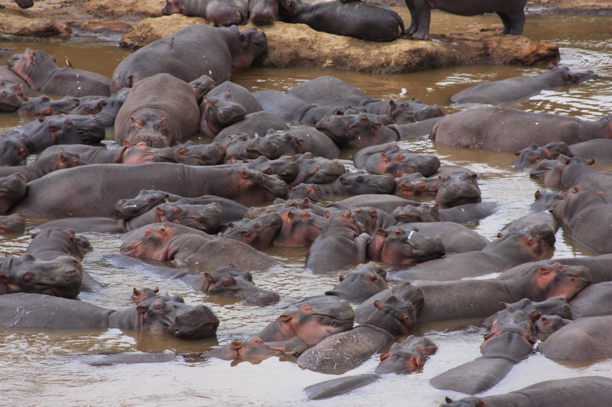
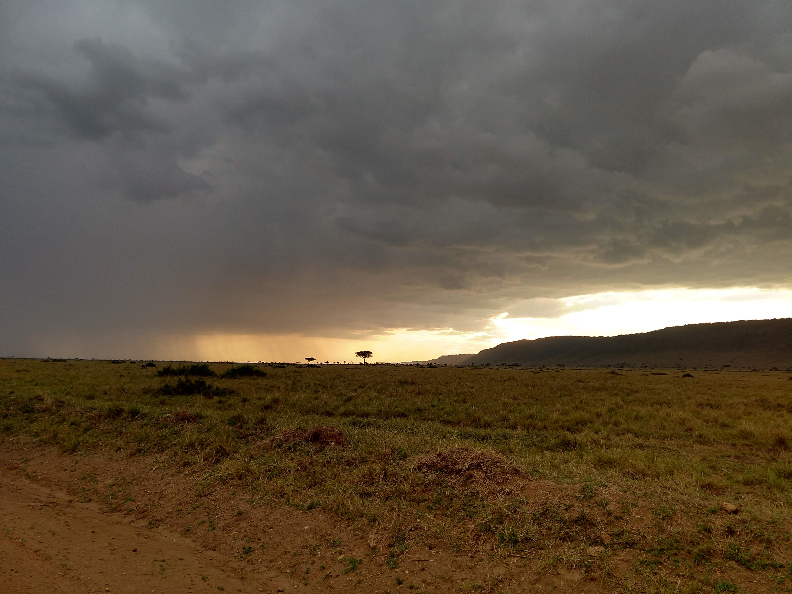
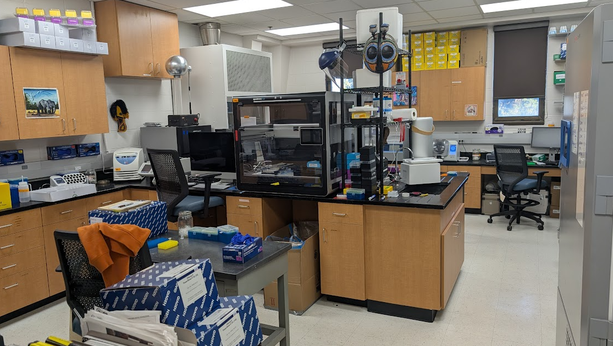
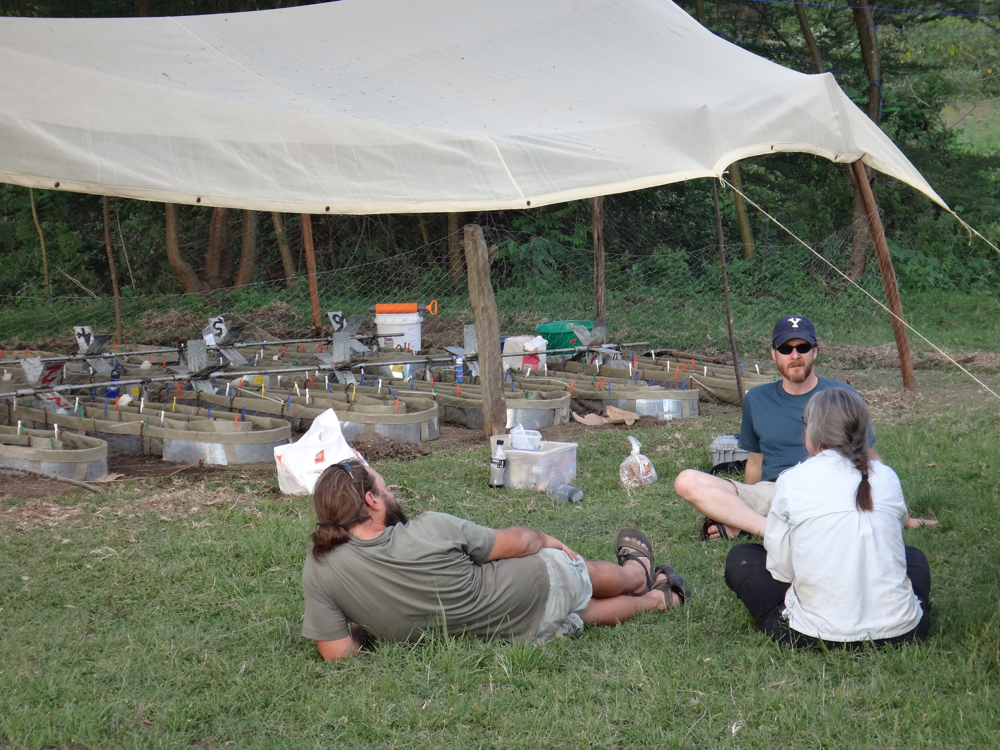

[TL;DR? Jump to the easy explainer](#easy-explainer)

Our research seeks to describe and quantify how animals and their microbial symbionts (microbiomes) alter microbial community composition and ecosystem function within the environment, how these dynamics are influenced by environmental variability, and what they mean for the health of animals and people. Our research currently addresses four central questions. 1) How do animals alter environmental biogeochemistry? 2) How does environmental variability alter interactions between animals, microbial communities and ecosystem function? 3) What are the abiotic and biotic drivers that allow microbial taxa to move between hosts and the environment? 4) What can a microbiome tell us about the health of an animal or a person, and how early can it tell us? We use a combination of observational studies along environmental gradients, historical reconstructions, mesocosm experiments, whole ecosystem manipulations, and laboratory automation to answer them.

We work in Kenya, the Democratic Republic of the Congo, South Africa, Colombia, and Florida, and with zoos and aquariums across the United States.

Our current research projects include:

- Can we predict the later health of an animal of conservation concern using passive fecal sampling and sequencing?
- Can we build a robotic rabbit realistic enough to serve as a python lure in the Everglades?
- How does the developing infant's gut microbiome alter their susceptibility to later disease?
- Can we use dolphins as environmental sentinels?
- How does carbon cycling change over the terrestrial aquatic interface of wetlands?
- How does the meta-gut dynamic with hippos in rivers alter their behavior?
- What stays constant in a hippo gut microbiome across wild, introduced, and managed care populations, and what does the environment override?
- How does artificial surface water change where large herbivores go, and what follows for the water they use?

## Animal influences on biogeochemistry

{:style="float: center;margin-right: 7px;:class="img-responsive"}

Animals can influence biogeochemistry of ecosystems in myriad ways. In aquatic systems, animals primarily influence biogeochemistry through consumption, egestion and excretion, death, and bioturbation. The influence of animals on aquatic systems depends on the animal's life history characteristics as well as the environmental context of the aquatic system. We use hippos and their pools as a model system to understand the potential effects of animals on aquatic biogeochemistry. Hippos can have substantial effects on aquatic biogeochemistry because of their large body size, their daily transport of terrestrial resources into aquatic ecosystems, and their tendency to aggregate in pools. The biogeochemical effects of hippos on different types of water bodies (rivers, lakes, or wetlands) can be significantly different depending on the in situ biogeochemical regimes. We developed a sediment fingerprinting method to quantify the proportion of riverine suspended sediment due to hippo dung, which allows us to quantify hippo dung transport under a range of flow conditions. We have used this technique in concert with sediment coring and dating to understand historical inputs by hippos within a whole-watershed context, and applied the same approach to erosion and sediment source problems in river basins across East Africa.

Dutton CL, Anisfeld SC, Ernstberger H. A novel sediment fingerprinting method using filtration: Application to the Mara River, East Africa. Journal of Soils and Sediments. 2013 December; 13(10):1708. doi: 10.1007/s11368-013-0725-z.

Subalusky AL, Dutton CL, Rosi EJ, Post DM. Annual mass drownings of the Serengeti wildebeest migration influence nutrient cycling and storage in the Mara River. Proc Natl Acad Sci U S A. 2017 Jul 18;114(29):7647-7652. doi: 10.1073/pnas.1614778114.

Subalusky AL, Dutton CL, Njoroge L, Rosi EJ, Post DM. Organic matter and nutrient inputs from large wildlife influence ecosystem function in the Mara River, Africa. Ecology. 2018 Nov;99(11):2558-2574. doi: 10.1002/ecy.2509.

Schoelynck J, Subalusky AL, Struyf E, Dutton CL, Unzué-Belmonte D, Van de Vijver B, Post DM, Rosi EJ, Meire P, Frings P. Hippos (Hippopotamus amphibius): The animal silicon pump. Sci Adv. 2019 May;5(5):eaav0395. doi: 10.1126/sciadv.aav0395.

Masese FO, Kiplagat MJ, González-Quijano CR, Subalusky AL, Dutton CL, Post DM, Singer GA. Hippopotamus are distinct from domestic livestock in their resource subsidies to and effects on aquatic ecosystems. Proc R Soc B. 2020;287:20193000. doi: 10.1098/rspb.2019.3000.

Akayezu P, Musinguzi L, Natugonza V, Ogutu-Ohwayo R, Mwathe K, Dutton CL, Manyifika M. Using sediment fingerprinting to identify erosion hotspots in a sub-catchment of Lake Kivu, Rwanda. Environmental Monitoring and Assessment. 2020. doi: 10.1007/s10661-020-08774-5.

Pringle RM, Abraham JO, Anderson TM, Coverdale TC, Davies AB, Dutton CL, Gaylard A, Goheen JR, Holdo RM, Hutchinson MC, Kimuyu CM, Long RA, Subalusky AL, Veldhuis MP. Impacts of large herbivores on terrestrial ecosystems. Current Biology. 2023;33:11.

Saha AK, Dutton C, Manyifika M, Jantzi SC, Sirikare SN. Sediment fingerprinting enables the determination of soil erosion sources and sediment transport processes in a topographically complex Nile headwater basin. Soil Systems. 2025;9(3):70.

Twining CW, Blanco A, Dutton C, Kainz M, Harvey E, Kraus J, Martin-Creuzburg D, et al. Integrating the bright and dark sides of aquatic resource subsidies, a synthesis. Ecology Letters. 2025. doi: 10.1111/ele.70109.

Subalusky AL, Dutton C. Role of aquatic and terrestrial carcasses in freshwater ecosystems. In: Carrion Ecology, Evolution, and Their Applications. 2025.

Frauendorf TC, Reside A, Dutton CL, Njoroge L, Njagi E, Rosi EJ, Post DM, Subalusky AL. A gradient of wildlife subsidies alters riverine food web structure. Freshwater Biology. 2026;71(4):e70208.

## Environmental variability as a driver of biogeochemical and microbial community change

{:style="float: center;margin-right: 7px;:class="img-responsive"}

Many ecosystems are facing increasing environmental variability due to changes in temperature and precipitation patterns caused by climate change. In East Africa, the amount of precipitation is projected to increase slightly but become much more variable, with more frequent and intense droughts. We study how this environmental variability alters interactions between animals, their microbial symbionts, environmental microbial communities, and aquatic ecosystem function. We have shown that hippo pools can become increasingly toxic to aquatic life in periods between flushing flows (periodic flood events). When these pools are flushed during episodic rains, large fish kills can occur due to the mobilization of reduced compounds and very high sediment loads. As flows become more irregular, these fish kill events could be increasing, causing other potential changes in ecosystem function. We use mesocosm experiments and whole ecosystem manipulations to document the response of environmental microbial communities and aquatic biogeochemistry to changes in environmental variability, and low-cost open source instrumentation to document that variability across our study regions and between experimental treatments.

Dutton CL, Subalusky AL, Anisfeld SC, Njoroge L, Rosi EJ, Post DM. The influence of a semi-arid sub-catchment on suspended sediments in the Mara River, Kenya. PLoS One. 2018;13(2):e0192828. doi: 10.1371/journal.pone.0192828.

Dutton CL, Subalusky AL, Hamilton SK, Rosi EJ, Post DM. Organic matter loading by hippopotami causes subsidy overload resulting in downstream hypoxia and fish kills. Nat Commun. 2018 May 16;9(1):1951. doi: 10.1038/s41467-018-04391-6.

Dutton CL, Subalusky AL, Hill TD, Aleman JC, Rosi EJ, Onyango KB, Kanuni K, Cousins JA, Staver AC, Post DM. A 2000-year sediment record reveals rapidly changing sedimentation and land use since the 1960s in the Upper Mara-Serengeti Ecosystem. Sci Total Environ. 2019 May 10;664:148-160. doi: 10.1016/j.scitotenv.2019.01.421.

Dutton CL, Subalusky AL, Hamilton SK, Bayer EC, Njoroge L, Rosi EJ, Post DM. Alternative biogeochemical states of river pools mediated by hippo use and flow variability. Ecosystems. 2020. doi: 10.1007/s10021-020-00518-3.

Frauendorf T, Subalusky AL, Dutton CL, Hamilton SK, Masese FO, Rosi EJ, Singer GA, Post DM. Animal legacies lost and found in freshwater ecosystems. Environmental Research Letters. 2021. doi: 10.1088/1748-9326/ac2cb0.

Blaszczak JR, Koenig LE, Mejia FH, Gómez-Gener L, Dutton CL, Carter AM, Grimm NB, Harvey JW, Helton AM, Cohen MJ. Extent, patterns, and drivers of hypoxia in the world's streams and rivers. Limnology and Oceanography Letters. 2022. doi: 10.1002/lol2.10297.

Kemp A, Vane CH, Kim A, Dutton CL, Subalusky A, Kemp S, Parnell A. Fecal steroids as a potential tool for conservation paleobiology in East Africa. Biodiversity and Conservation. 2022. doi: 10.1007/s10531-021-02328-y.

## Interactions between gut microbiome and environmental microbe communities

{:style="float: center;margin-right: 7px;:class="img-responsive"}

Through defecation and death, animals transfer a portion of their gut microbiome to the environment together with the organic matter, nutrients, and metabolic byproducts that comprise their feces or carcass. These inputs can directly shape the external environment in a way that can support the persistence of gut microbiota outside the host gut. These dynamics could influence microbial community assembly in both the host and the environment, with subsequent effects on ecosystem function and transference amongst hosts. The potential effects of animal gut microbiomes on biogeochemical cycles remain poorly understood. Our research has shown that hippo inputs can drive anoxic conditions in hippo pools, which may facilitate the persistence of hippo gut microbes that accompany defecation. We have also shown that microbial communities in hippo pools converge on that of the hippo gut under certain conditions, raising the possibility that hippo gut microbiota influence ecosystem function in hippo pools and may be re-ingested by hippos and other taxa sharing that environment. Thus, in high-density hippo pools, the pool can function as a coupled gut-environment meta-ecosystem, a metagut. We use 16S rRNA sequencing and transcriptomics to characterize hippo gut microbiomes and the dormant and active microbial communities within hippo pools at different densities and environmental contexts, and we use the hippo system to identify the abiotic and biotic drivers controlling microbiome transference between hosts and the environment.

We are extending this work across hippo populations that differ in nearly everything except the host species. We compare gut microbiomes among wild hippos in the Mara, the introduced population of the Magdalena River in Colombia, and hippos in human managed care at US zoos, which vary in diet, water chemistry, and animal density. The population modeling and management side of the Colombian work is led by the Subalusky lab with [Elizabeth Anderson](https://www.tropicalriverslab.net/elizabeth-anderson) at Florida International University.

Dutton CL. Animal inputs drive shifts in biogeochemical processes and microbial communities. PhD Dissertation. Department of Ecology and Evolutionary Biology. 2019. New Haven, CT: Yale University.

Handler KS, Subalusky AL, Kendall CJ, Dutton CL, Rosi EJ, Post DM. Temporal resource partitioning of wildebeest carcasses by scavengers after riverine mass mortality events. Ecosphere. 2021. doi: 10.1002/ecs2.3326.

Dutton CL, Subalusky AL, Sanchez A, Estrela S, Lu N, Hamilton SK, Njoroge L, Rosi EJ, Post DM. The meta-gut: community coalescence of animal gut and environmental microbiomes. Scientific Reports. 2021 December. doi: 10.1038/s41598-021-02349-1. Named one of the [top 100 papers in Microbiology at Scientific Reports for 2021](https://www.nature.com/collections/jejbehijhi).

Dutton CL, Goeckner A, Goldwire T, Grupstra CGB, Houghtaling D, Nonnamaker LE, Subalusky A. Bioreactors on the move: how animals contribute to microbial community coalescence and shape ecosystem function. Environmental Microbiology. 2026;28(4):e70291. doi: 10.1111/1462-2920.70291.

## Microbiomes and animal health

{:class="img-responsive"}

Nearly every animal in human managed care is a species with no reference gut microbiome, so there is no baseline against which a veterinarian can read a change. We build those baselines from feces, which requires no handling, no anesthesia, and no restraint. Sampling runs across institutions accredited by the Association of Zoos and Aquariums, and DNA extraction and full-length 16S nanopore sequencing run on the [lab's Opentrons OT-2 and Flex robots](/lab/), which is what makes work at this sample volume affordable. Sampled species range from great apes and gibbons to okapi, giraffe, rhinoceros, and hippopotamus, among many others. The lab holds research agreements with more than 20 US zoos and aquariums.

The same non-invasive approach extends to free-living animals. We are testing whether bottlenose dolphins can serve as environmental sentinels for coastal health by characterizing their respiratory microbiomes, in collaboration with the [UF Marine Animal Rescue Program](https://cdpm.vetmed.ufl.edu/services/marine-animal-rescue-program/) and the [Cedar Key Dolphin Project](https://www.cedarkeydolphinproject.org/#/).

## Microbiomes and human health

The questions that make a microbiome informative about an animal apply to people. Working in the Democratic Republic of the Congo with collaborators in anthropology and public health, we have shown that maternal psychosocial stress during pregnancy is associated with reduced diversity in the early infant gut microbiome, and that the composition of that early microbiome predicts a child's later susceptibility to malaria. The analysis code and data for the malaria work are public at [UFDuttonLab/congo-malaria-microbiome](https://github.com/UFDuttonLab/congo-malaria-microbiome).

Dutton CL, Maisha FM, Quinn E, Morales KL, Moore J, Mulligan CJ. Maternal psychosocial stress is associated with reduced diversity in the early infant gut microbiome. Microorganisms. 2023 Jan;11(4):975.

Mulligan CJ, Quinn EB, Hamadmad D, Dutton CL, Nevell L, Binder AM, Panter-Brick C, Dajani R. Epigenetic signatures of intergenerational exposure to violence in three generations of Syrian refugees. Scientific Reports. 2025. doi: 10.1038/s41598-025-89818-z.

Dutton CL, Follis M, Munaweera J, Maisha FM, Mulligan CJ, Moore JM. The gut microbiome in early life predicts malaria susceptibility. Frontiers in Cellular and Infection Microbiology. 2026;16:1769376.

## Wildlife, water, and management

Where large animals can reach water determines where their inputs land. In Kruger National Park, South Africa, we work on how artificial surface water changes the spatial and temporal footprint of herbivores, and how impoundments alter elephant distribution and activity. Across East African rangelands we work on how livestock intensification interacts with wildlife populations over time scales long enough to detect an effect.

We have proposed the ripple effect as a framework for the ecological impacts of surface water in drylands, which comprise 41 percent of the Earth's surface. The piosphere concept describes localized degradation of soil and vegetation around a water source; the ripple effect extends it to the cross-scale, reciprocal impacts that animal aggregations generate across linked terrestrial and aquatic ecosystems, and identifies the restoration of spatiotemporal variability in surface water as the management target.

Ogutu JO, Stabach JA, Hopcraft JGC, Boone RB, Dublin HT, Dutton CL, et al. Short-term study fails to capture negative impacts of livestock intensification on wildlife. Proc Natl Acad Sci U S A. 2025;122(23). doi: 10.1073/pnas.2502418122.

McCleery RA, Ferreria SM, Mhlava P, Mathebula O, Tanneback T, Coetsee C, Dalu T, Dutton CL, Khosa D, Munyai LF, Parker DM, Subalusky AL, Twala B, Voysey MD, Wigley BJ. Artificial surface water broadens the spatiotemporal footprint of herbivores and alters species responses. Ecological Applications. 2026;36(1):e70185.

Twala BB, Ngcobo SP, McCleery RA, Dalu T, Dutton CL, Ferreria SM, Munyai L, Subalusky A, Voysey MD, Coetsee C, Wigley B, Parker DM. Effects of water impoundments on the distribution and activity of elephants in the southern Kruger National Park. African Journal of Ecology. 2026;64(2):e70154.

Subalusky AL, Dutton CL, McCleery RA. The ripple effect of surface water on dryland ecosystems. Trends in Ecology & Evolution. 2026. doi: 10.1016/j.tree.2026.07.004.

## Invasive species and open source technology

{:class="img-responsive"}

We prioritize open source and low-cost hardware because it lets us instrument more sites, replicate more treatments, and rebuild what the field destroys. The clearest example is the robotic rabbit project in the Everglades. We strip toy rabbits and rebuild them with motors, heaters, and solar power so they carry the movement and body temperature of a marsh rabbit, then place them in pens watched by a motion-triggered camera that signals a removal team when a Burmese python approaches. Live rabbits drew about one python a week but were too labor-intensive to keep in the field. The work is done with Robert McCleery's lab in UF Wildlife Ecology and Conservation and the South Florida Water Management District, and was covered by [CBS News](https://www.cbsnews.com/news/burmese-pythons-robot-rabbits-florida-invasive-species/), [The Washington Post](https://www.washingtonpost.com/national/2025/08/28/pythons-everglades-florida-robot-rabbits/df3f630c-83c4-11f0-a8f4-28ba053d904b_story.html), and [Smithsonian](https://www.smithsonianmag.com/smart-news/robo-bunnies-are-the-newest-weapon-in-the-fight-against-invasive-burmese-pythons-in-florida-180987018/) in 2025.

The same approach produced our low-cost environmental sensors, our laboratory automation, and the scheduling software the lab runs on. Instrument details are on the [Lab](/lab/) page.

Klein R, Dutton CL, Koeser AK. Development of a low-cost traffic counter for assessing likelihood of impact for tree risk assessment. Arboricultural Journal. 2022. doi: 10.1080/03071375.2022.2030603.

## Easy explainer

<blockquote class="twitter-tweet">
What in the world just happened? Why were all the fish dead? Here’s a short thread as to how our latest paper, the last of my PhD at <a href="https://twitter.com/yale_eeb?ref_src=twsrc%5Etfw">@yale_eeb</a>, came to be by starting at the beginning. <a href="https://t.co/xQSSM0C8W9">pic.twitter.com/xQSSM0C8W9</a>
&mdash; Christopher L Dutton (@ChrisLDutton) <a href="https://twitter.com/ChrisLDutton/status/1467892263380529157?ref_src=twsrc%5Etfw">December 6, 2021</a></blockquote> 

A full chronological publication list is on the [Publications](/publications/) page.

  <h3 style="margin-top: 0; font-size: 20px;">Support our research</h3>
  
Gifts to the WILDS fund at the University of Florida Foundation send students into the field, pay for sequencing, and keep our sensors and field operations running in Kenya and Florida.

  
<a href="/support/">How to give, and what your gift funds</a>

