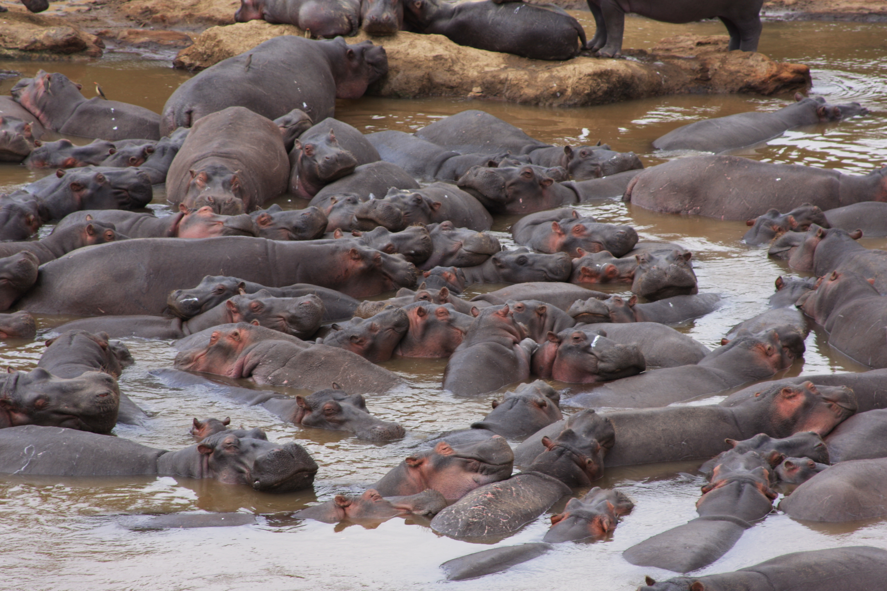

[TL;DR? Jump to my easy explainer](#Here-is-an-easy-explainer-on-some-of-my-research)

### My Multi Word Header

My research seeks to describe and quantify how animals and their microbial symbionts (microbiomes) alter microbial community composition and ecosystem function within the environment, and how these dynamics are influenced by environmental variability. My research currently addresses three central questions. 1) How do animals alter environmental biogeochemistry? 2) How does environmental variability alter interactions between animals, microbial communities and ecosystem function? 3) What are the abiotic and biotic drivers that allow microbial taxa to move between hosts and the environment? I use a combination of observational experiments along environmental gradients, historical reconstructions, mesocosm experiments, and whole ecosystem manipulations to understand the role of animals and their microbiomes on ecosystem function.

Since 2020, I've begun to expand upon these ideas and I'm currently working with an international team of geneticists and anthropologists to understand how maternal stress/trauma can alter the microbiome of the developing infant within a population of Congolese dyads. As part of this team, we are also working to decipher the transgenerational transmission of epigenetic signals from violence exposure in multigenerational Syrian families. Working between biogeochemistry, environmental ecosystem functioning, microbial communities, and now with human populations and their lived experience, I am becoming uniquely suited to help bridge the gap between environmental health and human health. A healthier environment ultimately leads to healthier people. Environmental conservation is not just for the plants and animals, it is also to improve human well-being

## Animal influences on biogeochemistry

{:style="float: center;margin-right: 7px;:class="img-responsive"}

Animals can influence biogeochemistry of ecosystems in myriad ways. In aquatic systems, animals primarily influence biogeochemistry through consumption, egestion and excretion, death, and bioturbation. The influence of animals on aquatic systems depends on the animal’s life history characteristics as well as the environmental context of the aquatic system. I use hippos and their pools as a model system to understand the potential effects of animals on aquatic biogeochemistry. I use hippos and their pools as a model system to understand the potential effects of animals on aquatic biogeochemistry. Hippos can have substantial effects on aquatic biogeochemistry because of their large body size, their daily transport of terrestrial resources into aquatic ecosystems, and their tendency to aggregate in pools. The biogeochemical effects of hippos on different types of water bodies (rivers, lakes, or wetlands) can be significantly different depending on the in situ biogeochemical regimes. I developed a sediment fingerprinting method to quantify the proportion of riverine suspended sediment due to hippo dung, which has allowed me to quantify hippo dung transport under a range of flow conditions. I also used this technique in concert with sediment coring and dating to understand historical inputs by hippos within a whole-watershed context. I have also used this approach to address broader conservation and management concerns in river basins through East Africa.

Dutton CL, Anisfeld SC, Ernstberger H. A novel sediment fingerprinting method using filtration: Application to the Mara River, East Africa. Journal of Soils and Sediments. 2013 December; 13(10):1708. doi: 10.1007/s11368-013-0725-z.

Schoelynck J, Subalusky AL, Struyf E, Dutton CL, Unzué-Belmonte D, Van de Vijver B, Post DM, Rosi EJ, Meire P, Frings P. Hippos (Hippopotamus amphibius): The animal silicon pump. Sci Adv. 2019 May;5(5):eaav0395. doi: 10.1126/sciadv.aav0395. eCollection 2019 May. PubMed PMID: 31049394; PubMed Central PMCID: PMC6494503.

Subalusky AL, Dutton CL, Njoroge L, Rosi EJ, Post DM. Organic matter and nutrient inputs from large wildlife influence ecosystem function in the Mara River, Africa. Ecology. 2018 Nov;99(11):2558-2574. doi: 10.1002/ecy.2509. Epub 2018 Oct 8. PubMed PMID: 30179253.

Subalusky AL, Dutton CL, Rosi EJ, Post DM. Annual mass drownings of the Serengeti wildebeest migration influence nutrient cycling and storage in the Mara River. Proc Natl Acad Sci U S A. 2017 Jul 18;114(29):7647-7652. doi: 10.1073/pnas.1614778114. Epub 2017 Jun 19. PubMed PMID: 28630330; PubMed Central PMCID: PMC5530641.

## Environmental variability as a driver of biogeochemical and microbial community change

{:style="float: center;margin-right: 7px;:class="img-responsive"}

Many ecosystems are facing increasing environmental variability due to changes in temperature and precipitation patterns caused by climate change. In East Africa, the amount of precipitation is projected to increase slightly but become much more variable, with more frequent and intense droughts. I study how this environmental variability alters interactions between animals, their microbial symbionts, environmental microbial communities, and aquatic ecosystem function. I have previously shown that hippo pools can become increasingly toxic to aquatic life in periods between flushing flows (periodic flood events). When these pools are flushed during episodic rains, large fish kills can occur due to the mobilization of reduced compounds and very high sediment loads. As flows become more irregular, these fish kill events could be increasing, causing other potential changes in ecosystem function. I use mesocosm experiments and whole ecosystem manipulations to document the response of environmental microbial communities and aquatic biogeochemistry to changes in environmental variability. I also use low-cost open source technologies to document environmental variability across my study region and between experimental treatments.

Dutton CL, Subalusky AL, Hamilton SK, Rosi EJ, Post DM. Organic matter loading by hippopotami causes subsidy overload resulting in downstream hypoxia and fish kills. Nat Commun. 2018 May 16;9(1):1951. doi: 10.1038/s41467-018-04391-6. PubMed PMID: 29769538; PubMed Central PMCID: PMC5956076.

Dutton CL, Subalusky AL, Anisfeld SC, Njoroge L, Rosi EJ, Post DM. The influence of a semi-arid sub-catchment on suspended sediments in the Mara River, Kenya. PLoS One. 2018;13(2):e0192828. doi: 10.1371/journal.pone.0192828. eCollection 2018. PubMed PMID: 29420624; PubMed Central PMCID: PMC5805331.

Dutton CL, Subalusky AL, Hill TD, Aleman JC, Rosi EJ, Onyango KB, Kanuni K, Cousins JA, Staver AC, Post DM. A 2000-year sediment record reveals rapidly changing sedimentation and land use since the 1960s in the Upper Mara-Serengeti Ecosystem. Sci Total Environ. 2019 May 10;664:148-160. doi: 10.1016/j.scitotenv.2019.01.421. Epub 2019 Feb 1. PubMed PMID: 30739850.

Dutton CL, Subalusky AL, Hamilton SK, Bayer EC, Njoroge L, Rosi EJ, Post DM. Alternative Biogeochemical States of River Pools Mediated by Hippo Use and Flow Variability. Ecosystems. 2020 June; doi: 10.1007/s10021-020-00518-3.

## Interactions between gut microbiome and environmental microbe communities

{:style="float: center;margin-right: 7px;:class="img-responsive"}

Through defecation and death, animals transfer a portion of their gut microbiome to the environment together with the organic matter, nutrients, and metabolic byproducts that comprise their feces or carcass. These inputs can directly shape the external environment in a way that can support the persistence of gut microbiota outside the host gut. These dynamics could influence microbial community assembly in both the host and the environment, with subsequent effects on ecosystem function and transference amongst hosts. The potential effects of animal gut microbiomes on biogeochemical cycles remain poorly understood. My research has shown that hippo inputs can drive anoxic conditions in hippo pools, which may facilitate the persistence of hippo gut microbes that accompany defecation. I have also shown that microbial communities in hippo pools converge on that of the hippo gut under certain conditions, raising the possibility that hippo gut microbiota influence ecosystem function in hippo pools and may be re-ingested by hippos and other taxa sharing that environment. Thus, in high-density hippo pools, the pool can function as a coupled gut-environment meta-ecosystem – a metagut. I use 16S rRNA sequencing and transcriptomics to characterize hippo gut microbiomes and the dormant and active microbial communities within hippo pools at different densities and environmental contexts. I use the hippo system to understand microbiome transference between hosts and the environment and to identify the abiotic and biotic drivers controlling this process.

Dutton CL. Animal Inputs Drive Shifts in Biogeochemical Processes and Microbial Communities. PhD Dissertation. Department of Ecology and Evolutionary Biology. 2019. New Haven, CT: Yale University.

Dutton, CL, A. L. Subalusky, A. Sanchez, S. Estrela, N. Lu, S. K. Hamilton, L. Njoroge, E. J. Rosi, and D. M. Post. The meta-gut: community coalescence of animal gut and environmental microbiomes. Nature Scientific Reports. 2021 December. doi: 10.1038/s41598-021-02349-1

## Here is an easy explainer on some of my research

<blockquote class="twitter-tweet">
What in the world just happened? Why were all the fish dead? Here’s a short thread as to how our latest paper, the last of my PhD at <a href="https://twitter.com/yale_eeb?ref_src=twsrc%5Etfw">@yale_eeb</a>, came to be by starting at the beginning. <a href="https://t.co/xQSSM0C8W9">pic.twitter.com/xQSSM0C8W9</a>
&mdash; Christopher L Dutton (@ChrisLDutton) <a href="https://twitter.com/ChrisLDutton/status/1467892263380529157?ref_src=twsrc%5Etfw">December 6, 2021</a></blockquote> 

