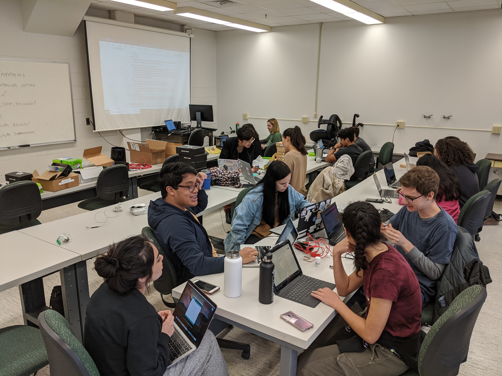
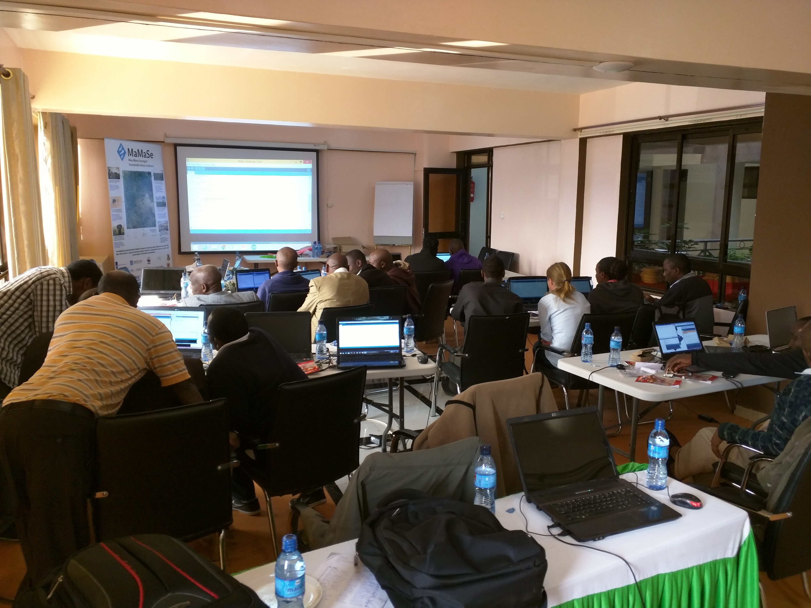
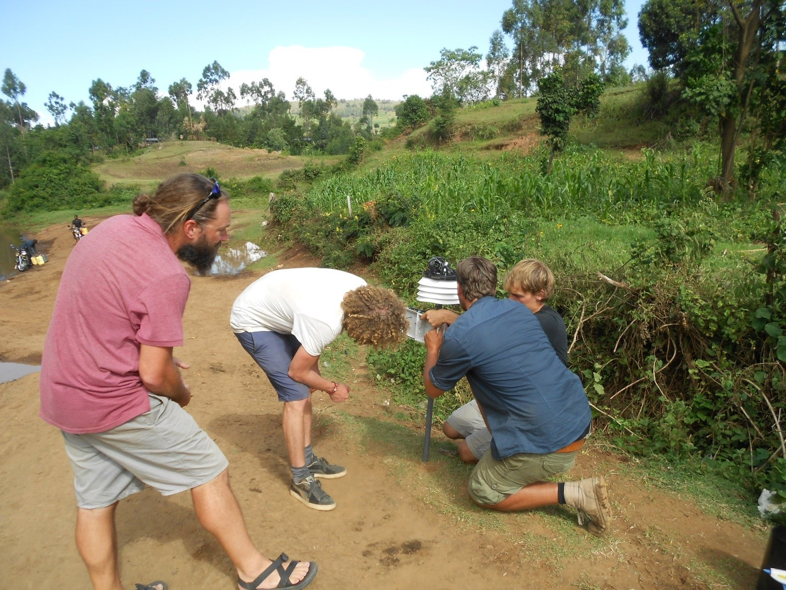

Join me for one of my courses at the University of Florida!

 - Data Collection with Open Technologies for Reproducible Research (Fall 2020) 
 - Research Skills with Arduino and R (Spring 2019)
 - Animal and Ecosystem Microbiomes (Spring 2024)
 - Ecology of the Microbiome (Fall 2024)

{:style="float: center;margin-right: 7px;:class="img-responsive"}

{:style="float: center;margin-right: 7px;:class="img-responsive"}

{:style="float: center;margin-right: 7px;:class="img-responsive"}
